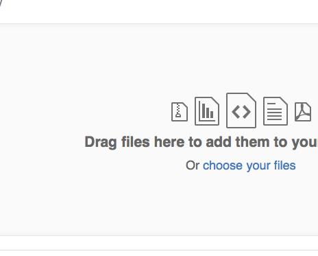

# Kids-Prediction
## Analisis DataSet

Esto es un texto.

| Operador        | Promedio de la operación           | Cantidad de Operaciones por Operando  |
| ------------- |:-------------:| -----:|
| *     | right-aligned | $1600 |
| +     | centered      |   $12 |
| - | are neat      |    $1 |

Query
select operator, tiempoTotal/cantidadOperaciones as Promedio from
(select operator, count(*) as cantidadOperaciones, sum(time) as tiempoTotal from Kids
where time > 0
group by operator)t1;

 Operador || Promedio || Total de Operacion
 * || 21.031378771354227 || 1475
 + || 6.685182462277273  || 1550
 - || 7.998301098835512  || 1518
 / || 5.21660610851151   || 1519
 
 El análisis 
