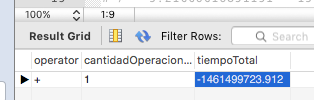
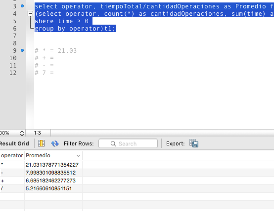

# Kids-Prediction
## Análisis DataSet

Utilizamos una base de datos Mysql unicamente para hacer un análisis más rapido sobre el conjunto de dataset y encontrar anomalias, sobre como fueron creados los dataset.

### Query donde encontramos un error de un valor negativo
select operator, count(*) as cantidadOperaciones, sum(time) as tiempoTotal from Kids
where time < 0;

### Query donde encontramos el promedio por cada operando
select operator, tiempoTotal/cantidadOperaciones as Promedio, cantidadOperaciones from
(select operator, count(*) as cantidadOperaciones, sum(time) as tiempoTotal from Kids
where time > 0
group by operator)t1;

| Operador        | Promedio de la operación           | Cantidad de Operaciones por Operando  |
| ------------- |:-------------:| -----:|
| *     | 21.031378771354227    |   1475 |
| +     | 6.685182462277273     |   1550 |
| -     | 7.998301098835512     |   1518 |
| /     | 5.21660610851151      |   1519 |

 El análisis que realizamos es 
